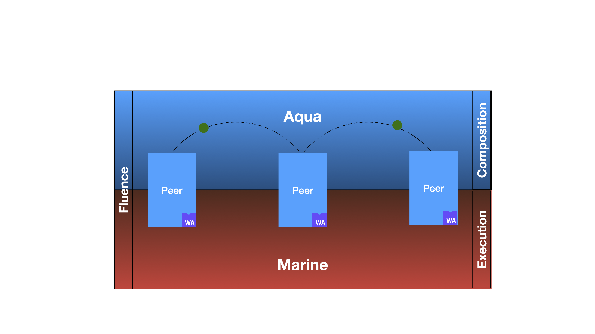

# Fluence network environment

[](https://www.npmjs.com/package/@fluencelabs/fluence-network-environment)

Maintained list of well-known Fluence network nodes. The package is meant to be used in combination with [Fluence JS SDK](https://github.com/fluencelabs/fluence-js).

## Installation

With npm

```bash
npm install @fluencelabs/fluence-network-environment
```

With yarn

```bash
yarn add @fluencelabs/fluence-network-environment
```

## Usage

Pick a node to connect to the Fluence network.

```typescript
import { testNet } from "@fluencelabs/fluence-network-environment";

export const relayNode = testNet[0];
```

Which can be used to initialize the Fluence client (see [Fluence JS SDK](https://github.com/fluencelabs/fluence-js).)

```typescript
import { FluencePeer } from "@fluencelabs/fluence";

const peer = new FluencePeer();
await peer.start({ connectTo: relayNode });
```

## Known networks

- stage - unstable network for development tests; low capacity
- TestNet - more stable network, used for QA of new releases; higher capacity
- Kras - stable network, has the highest load capacity

All 3 networks are connected, i.e. any node can be discovered from every other. They're open and permissionless, meaning that anyone can use any node for bootstrapping.

## Fluence Stack

|         Layer         |                                                               Tech                                                                |              Scale               |               State               |                                                   Based on                                                    |
| :-------------------: | :-------------------------------------------------------------------------------------------------------------------------------: | :------------------------------: | :-------------------------------: | :-----------------------------------------------------------------------------------------------------------: |
|       Execution       |                                          [Marine](https://github.com/fluencelabs/marine)                                          |           Single peer            | Disk, network, external processes | Wasm, [IT](https://github.com/fluencelabs/interface-types), [Wasmer\*](https://github.com/fluencelabs/wasmer) |
|      Composition      |                                            [Aqua](https://github.com/fluencelabs/aqua)                                            |          Involved peers          |      Results and signatures       |                                                 ⇅, π-calculus                                                 |
|       Topology        | [TrustGraph](https://github.com/fluencelabs/fluence/tree/master/trust-graph), [DHT\*](https://github.com/fluencelabs/rust-libp2p) | Distributed with Kademlia\* algo |    Actual state of the network    |                                [libp2p](https://github.com/libp2p/rust-libp2p)                                |
| Security & Accounting |                                                            Blockchain                                                             |          Whole network           |        Licenses & payments        |                                                  substrate?                                                   |

<br/>

<p width="100%">

</p>

## License

[Apache 2.0](https://github.com/fluencelabs/fluence/blob/trustless_computing/LICENSE.md)
